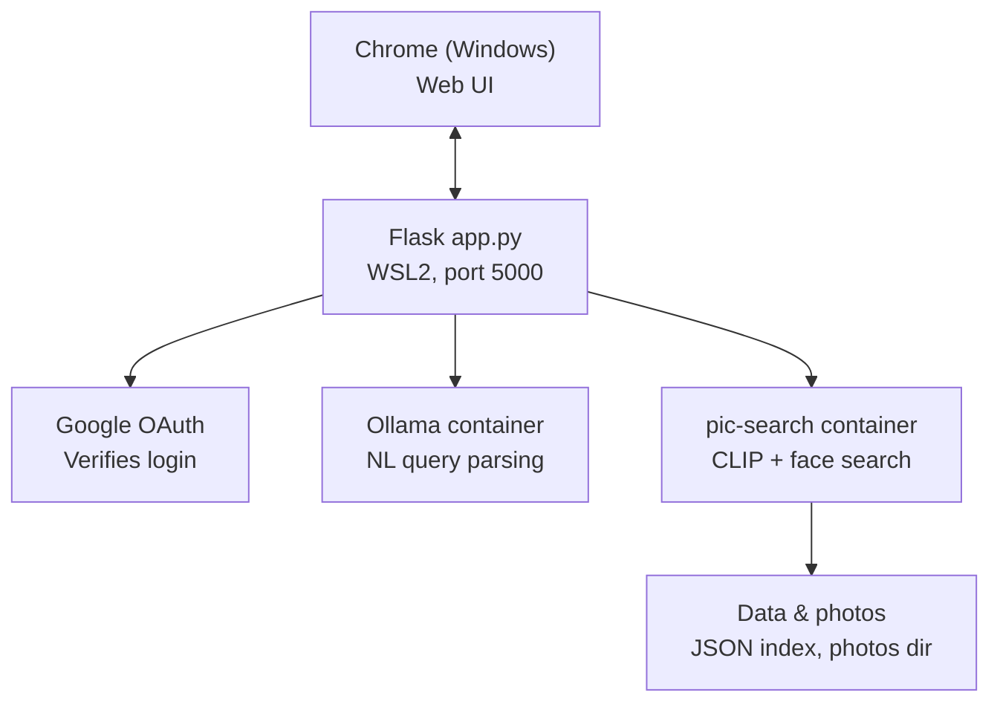

# pic-search Application

A fully local, natural-language photo search tool. Search your personal photo library (on a local disk) by describing a scene ("a waterfall"), by naming people in reference photos ("Jack and Jill"), or both together ("find images of Jack and Jill on a hill") — all running on your own PC, with no photos or search data ever leaving your local machine (unless you choose to expose the web UI publicly — see "Public HTTPS Access" below).

## Why I made it

Commercial photo apps (Google Photos, Apple Photos) offer this kind of search, but only if your photos live in their cloud. This project reproduces the core capability — concept search plus face recognition, combined via natural language — as a self-hosted, open-source stack you run entirely offline in containers.

## How it works

1. You type a query like `find images of Jack and Jill on a hill` into the web UI.
2. A local LLM (Ollama, running `llama3.2:3b`) parses the query into structured JSON: people mentioned and a scene description. Single-word queries that exactly match a known reference-face folder name skip the LLM entirely and go straight to face search, since a small model is unreliable on bare single-word input.
3. **Face recognition** (`insightface`, `buffalo_l` model) matches named people against reference photos you provide, one folder per person.
4. **CLIP** (`open_clip`, `laion2b_s34b_b79k`) matches the scene description against your indexed photo library using semantic image-text similarity.
5. Results from both are intersected and returned — photos that match the named people *and* the described scene — and rendered as randomized thumbnails in the browser (a fresh set of 5 on each search, not always the same top matches).

Note: Searching for "beach" does the same full-library sweep as searching for anything else — there's no index structure that lets it skip obviously-irrelevant photos. It's a linear scan: cost grows directly with library size. At 22k photos it's tolerable; at 200k it would be painful. The natural next step is to implement a vector database.

**[Jump to Setup ↓](#-setup)**

## The Application Architecture visualized with mermaid



`app.py`, `query_parser.py`, and `client_secret.json` all live together in the `pic-search` base directory and run **inside WSL2** (not native Windows Python) so that `app.py`'s `podman` subprocess calls and its own file access agree on the same filesystem. `/mnt/c/...`-style paths are a WSL convention that native Windows Python doesn't understand, and Podman Desktop's Windows-native podman is a separate backend from podman installed inside a WSL distro — running everything from the same WSL shell keeps `app.py`, `ollama`, and the `pic-search` image on one consistent podman backend. `main.py` and `face_search.py` stay in `./app`, since the `Containerfile` expects them there for the image build.

## Application Components

| Component | Role |
|---|---|
| `main.py` (in `./app`) | CLIP-based indexing and text-to-image concept search |
| `face_search.py` (in `./app`) | Face detection/recognition indexing and name-based search |
| `query_parser.py` | Sends the natural language query to Ollama, gets back structured JSON |
| Ollama (container) | Runs `llama3.2:3b` locally for query parsing |
| pic-search (container) | Runs CLIP + insightface indexing and search, built via `Containerfile` |
| `app.py` (Flask backend) | Web UI: Google OAuth login (allowlisted), `/search` endpoint tying together `query_parser.py`, CLIP search, and face search, `/image` endpoint serving photo bytes to the browser |

## Models and libraries

The project uses **three AI models**. It also uses **two image libraries** that people often mistake for models.

### AI models

| Model | Type | Purpose | Used in |
|---|---|---|---|
| `llama3.2:3b` | LLM (3B parameters) | Turns a natural-language query into `{people, scene}` JSON | `query_parser.py` (via Ollama) |
| CLIP `ViT-B-32` (`laion2b_s34b_b79k`) | Vision-language model | Scores how well images match text, for scene search | `main.py` (via `open_clip`) |
| insightface `buffalo_l` | Face model | Detects and recognizes faces | `face_search.py` |

### Supporting libraries (not models)

| Library | Purpose | Used in |
|---|---|---|
| `cv2` (OpenCV) | Reads image files into arrays | `face_search.py` |
| Pillow (`PIL`) | Opens and converts images | `main.py` |

### Known limitation: single-word queries

`llama3.2:3b` is the weakest model in the pipeline. With a bare one-word query, it could:

- treat a person's name as scene text, or
- repeat one of its few-shot examples word for word.

To avoid this, **single-word queries skip the LLM**. They're checked directly against the names of the reference-face folders.

### Web routes enabled by Flask

| Route | Purpose |
|---|---|
| `/` | Landing page — login button, or search box if already logged in |
| `/login` | Kicks off the Google OAuth flow |
| `/callback` | OAuth redirect target; checks the signed-in email against an allowlist before granting a session |
| `/search?query=...` | Case-insensitive: the whole query is lowercased on input, so "Jill"/"jill"/"JILL" all match the same way. Parses the query (bare single-word names bypass the LLM), runs CLIP/face search via `podman run`, intersects results, renders 5 randomized thumbnails |
| `/image?path=...` | Serves a photo's bytes so the browser can render it (translates the container-internal `/pictures/...` path to the real host path first) |
| `/browse?path=...` | File-explorer-style view of the Pictures directory — navigate folders, see thumbnails, drag-and-drop or use the upload form to add new photos into the current folder |
| `/upload?path=...` (POST) | Saves uploaded image files into the given folder under the Pictures directory; used by `/browse`'s drag-and-drop zone and upload form |
| `/logout` | Clears the session |

## Prerequisites

- Podman, installed inside a WSL2 Linux distro (developed/tested on RHEL 10) — run `app.py` from that same WSL shell, not from native Windows Python
- A folder of your own photos
- A `references_faces/` folder with one subfolder per person, containing a few clear reference photos of their face
- A Google Cloud OAuth client (`client_secret.json`) with `http://localhost:5000/callback` registered as a redirect URI (or your public HTTPS callback URL — see below)

---

## 🚀 Setup

> **Start here** to install and run pic-search
> Works from PowerShell or a WSL shell on Windows, or any Linux/macOS terminal

### 1. Clone and build

```bash
git clone https://github.com/bloveobs/pic-search.git
cd pic-search
podman build -t pic-search .
```

### 2. Configure your settings

Before you index anything, create your own copies of the **two config files** and edit them for your machine:

```bash
cp config_example.py config.py
cp config_example.sh config.sh
```

`config.py` and `config.sh` are listed in `.gitignore`, so your real paths, hostname and email addresses stay on your machine and are never committed.

**`config.sh`** is used by the shell scripts and container commands:

| Variable | What to set it to |
|---|---|
| `USER_DIR` | Your home directory as WSL sees it. The scripts index `$USER_DIR/Pictures`. |
| `BASE_DIR` | The `pic-search` directory itself (holds `data/` and `references_faces/`). |

**`config.py`** is used by the Python code:

| Setting | What to set it to |
|---|---|
| `PICTURES_DIR` | Your photo library, the same folder as `$USER_DIR/Pictures`. |
| `DATA_DIR` | `data/` inside the `pic-search` directory (`$BASE_DIR/data`). |
| `REFERENCES_FACES_DIR` | `references_faces/` inside the `pic-search` directory. |
| `PUBLIC_HOSTNAME` | Your public HTTPS hostname, e.g. `yourname.duckdns.org` (see "Public HTTPS Access"). |
| `SECRET_KEY` | A random value you generate (command below). |
| `ALLOWED_EMAILS` | The set of Google account emails allowed to log in. |

> ⚠️ If a setting appears in both files, make sure the values match.
> Indexing and searching won't work until these are set correctly.

`SECRET_KEY`: generate one with this command and paste the output in config.py
`python3 -c "import secrets; print(secrets.token_hex(32))"` 

### 3. Index your photos

Index your photo library for concept search:

```bash
chmod +x search.sh index_faces.sh index_photos.sh search_face.sh
./index_photos.sh
```

Index your photo library for face recognition (uses `references_faces/`). Note: `index_faces()` rescans your **entire** photo library against the **current full reference set** every run (not just new photos) — this is required so that adding a new person later correctly re-matches them against your existing library, not just newly-added photos:

```bash
./index_faces.sh
```

Run a concept search directly (bypassing the web UI):

```bash
./search.sh "a dog"
```

Run a face search directly:

```bash
./search_face.sh "Jill"
```

### 4. Start Ollama

Run Ollama locally for natural-language query parsing:

```bash
podman run -d --name ollama -p 127.0.0.1:11434:11434 -v ollama_data:/root/.ollama docker.io/ollama/ollama
podman exec -it ollama ollama pull llama3.2:3b
```

The `127.0.0.1:` prefix matters: Ollama's API has no authentication, and a bare `-p 11434:11434` publishes it to every device on your network.

### 5. Install the web UI's Python packages

`app.py` runs on the host, not in a container, so it needs its own packages (Flask, Google OAuth and so on). Install them once into a virtual environment, from the `pic-search` base directory:

```bash
python3 -m venv .venv
source .venv/bin/activate
pip install -r requirements.txt
```

Put your Google OAuth client file in the same directory, named `client_secret.json` (see Prerequisites).

### 6. Start the web UI

From the same WSL shell as the podman commands above, in the `pic-search` base directory, with the virtual environment active (`source .venv/bin/activate` in a new shell):

```bash
python3 app.py
```

Then open `http://localhost:5000` in your browser.

## Public HTTPS Access (optional)

The web UI can be exposed beyond `localhost` — to your home network or the public internet — but Google OAuth **requires a real HTTPS hostname**; it rejects raw IP addresses (including your router's public IP) as redirect URIs entirely, with the sole exception of `localhost`/`127.0.0.1`. Getting a real hostname with valid HTTPS working is most of the effort here.

### 1. Lock down Flask before exposing it

Two settings that are fine for `localhost`-only testing become real security holes once this is reachable from outside your machine. In `config.py`:

```python
SECRET_KEY = "<a real random value — generate one, see below>"
```

and at the bottom of `app.py`:

```python
app.run(host="localhost", port=5000, debug=False)
```

Keep `host="localhost"`. The app trusts Caddy's `X-Forwarded-For` / `X-Forwarded-Proto` headers (one proxy hop) to know the original request was HTTPS, so Flask must only be reachable through Caddy — anything that can reach port 5000 directly could fake those headers.

Generate a real secret once:
```bash
python3 -c "import secrets; print(secrets.token_hex(32))"
```
A fixed, hardcoded `secret_key` lets anyone who knows it forge a valid session cookie and bypass the Google login/allowlist entirely — don't commit a real secret to a public repo. `debug=True` also enables Flask's interactive debugger, which allows arbitrary code execution if triggered — fine on localhost, dangerous once public.

Start Caddy from the folder containing `caddy.exe` and your `Caddyfile`:

```powershell
.\caddy.exe run --config Caddyfile
```

### 2. Get a free dynamic-DNS hostname

Residential IPs (including Fiber) usually aren't static. [DuckDNS](https://www.duckdns.org) gives a free hostname (e.g. `yourname.duckdns.org`) that you keep pointed at your current IP via a small scheduled update.

Windows Task Scheduler, running every 5 minutes:
```powershell
Invoke-WebRequest -Uri "https://www.duckdns.org/update?domains=yourname&token=YOUR_TOKEN&ip="
```
Leaving `ip=` blank tells DuckDNS to auto-detect the caller's IP. If Task Scheduler prompts for your Windows account password and you use Windows Hello (no text password set), either set "Run only when user is logged on" instead of "run whether user is logged on or not," or set an actual account password under Settings → Accounts → Sign-in options.

### 3. Install Caddy and point it at Flask

[Caddy](https://caddyserver.com/download) is a reverse proxy that automatically obtains and renews a real Let's Encrypt certificate for your domain with minimal config. Run it **natively on Windows** (not inside WSL2) so it can bind directly to your machine's real network adapter — Windows already forwards `localhost` ports from WSL2 automatically, so Caddy can reach Flask at plain `localhost:5000` with no extra networking setup for that leg.

`Caddyfile`, in the same folder as `caddy.exe`:
```
yourname.duckdns.org {
    reverse_proxy localhost:5000
}
```

### 4. Port forward on your router

Forward external ports **80** and **443** (TCP) to your Windows machine's LAN IP. Port 80 is needed for Let's Encrypt's domain-ownership verification; port 443 serves your actual HTTPS traffic. Give that LAN IP a DHCP reservation first, so it never silently changes and breaks the forward. **A router reboot after adding the rules may be required** for them to actually take effect on some firmware.

Also open Windows Firewall for both ports (run as Administrator):
```powershell
New-NetFirewallRule -DisplayName "Caddy HTTP" -Direction Inbound -Protocol TCP -LocalPort 80 -Action Allow
New-NetFirewallRule -DisplayName "Caddy HTTPS" -Direction Inbound -Protocol TCP -LocalPort 443 -Action Allow
```

**Troubleshooting tips:**
- Check for double-NAT: compare your router's own reported WAN IP against what a device on your network sees at whatismyip.com — if they differ, something upstream of your router is also doing NAT and eating the forwarded traffic.
- Test locally first: from a phone on your home Wi-Fi, visit `http://<windows-lan-ip>` — this isolates Caddy/Windows Firewall from the router's port forward.
- Test externally with a phone on cellular data (Wi-Fi off) at [canyouseeme.org](https://canyouseeme.org) for port 80.
- **Carrier DNS filtering**: some cellular carriers (e.g. AT&T ActiveArmor) block freshly-created dynamic-DNS domains by default, showing a generic "no results" page that looks like a DNS failure but isn't — `nslookup yourdomain 8.8.8.8` and [dnschecker.org](https://dnschecker.org) resolving correctly means it's carrier-side filtering, not your setup. Try a different carrier/network to confirm.

### 5. Update the OAuth redirect URI

In Google Cloud Console, add `https://yourname.duckdns.org/callback` as an authorized redirect URI on your OAuth client. Then set `PUBLIC_HOSTNAME` in `config.py` to that domain; `/login` and `/callback` both build their `redirect_uri` from it.

## Metrics & Performance
Measured on a reference install:

### Hardware

- Lenovo X1 Carbon — Intel Core Ultra 7 258V, 32GB RAM, integrated GPU, 1.86TB SSD
- Google Fiber 1Gbps (for the public web UI)
- All inference runs CPU-only; no discrete GPU

### Library

| Metric | Value |
|---|---|
| Photos in library | 22,819 (76GB) |
| CLIP embeddings indexed | 22,804 (15 skipped — unreadable/corrupt) |
| Embedding dimensions | 512 |
| Photos with a recognized face | 5,107 (22%) |
| `index.json` size | 248MB |
| `faces.json` size | 737KB |

### Search latency

| Search type | Time |
|---|---|
| Scene search (CLIP) | 10.4s |
| Face search (insightface) | 0.76s |

The 14x gap is startup cost, not inference cost. Face search is a pure JSON lookup against `faces.json` — no model is loaded at query time, since all face matching happens during indexing. Scene search spins up a fresh container and loads the CLIP model into memory on every query; the actual similarity comparison across 22,804 embeddings is a small fraction of those 10 seconds. A long-running service instead of one container per query would close most of that gap.

Unexpected result: it works on dogs. `buffalo_l` is trained on human faces, but reference folders containing dogs return reasonable matches — presumably matching general visual features rather than true facial landmarks. Less reliable than for people, but usable.

### Known limitations at this scale

- Scene search is a linear scan: every query loads the full 248MB `index.json` and scores all 22,804 embeddings. Fine here, but a vector database (FAISS, Qdrant, Chroma) would be the natural next step past ~50k photos.
- Duplicate photos are not detected. The same image stored in multiple folders scores identically and consumes multiple result slots — dedup by content hash would improve effective result variety.
- ViT-B-32 is the smallest CLIP variant. Scene matches top out around 0.30 similarity, which is weak; ViT-L-14 would improve relevance at the cost of slower indexing.

## Caveats

- **Uploaded/dropped-in photos aren't searchable until you reindex.** `/browse` only adds files to the Pictures directory itself — it doesn't trigger `index_photos.sh` or `index_faces.sh` automatically. New photos won't show up in search results until you re-run both indexing scripts.
- **`/browse` and `/upload` expose your real filesystem, not a sandboxed view.** `PICTURES_DIR` points directly at your actual Windows Pictures folder, so any logged-in (allowlisted) user can navigate and upload into it exactly like a file explorer — there's no separate, more restricted "app storage" layer.
- **Search is fully case-insensitive.** The whole query string is lowercased before any parsing happens, so capitalization never affects whether a name or scene word matches.

## Status

- [x] CLIP concept search
- [x] Face recognition search
- [x] Natural language query parsing (local LLM via Ollama)
- [x] Flask web backend combining all three
- [x] Web UI with Google OAuth login (allowlisted)
- [x] Public HTTPS access (DuckDNS + Caddy + router port forwarding + Google OAuth, confirmed working end to end from outside the home network)
- [x] Browseable Pictures directory in the web UI, with drag-and-drop photo upload

## Privacy

Everything — photo indexing, face recognition, query parsing, and the web UI itself — runs locally in containers/WSL2 on your own machine. No photos, reference faces, or search queries are sent to any external service, aside from the OAuth login handshake with Google itself.

## Contributing

Bug reports, ideas and pull requests are welcome — see [CONTRIBUTING.md](CONTRIBUTING.md). For security problems, follow [SECURITY.md](SECURITY.md) instead of opening a public issue.

## Credits

Built with assistance from [Claude](https://claude.ai) (Anthropic), used throughout for architecture planning, debugging, and code generation.

## License

MIT License 

Copyright (c) 2026 bloveobs
